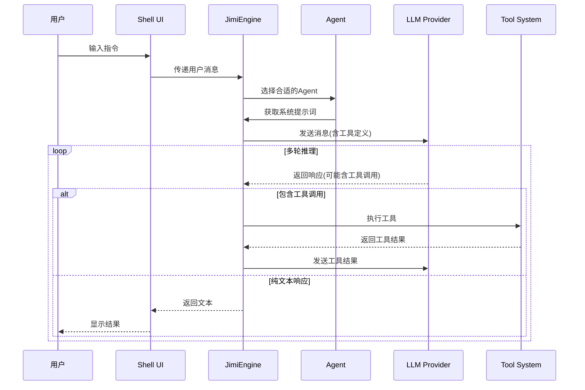
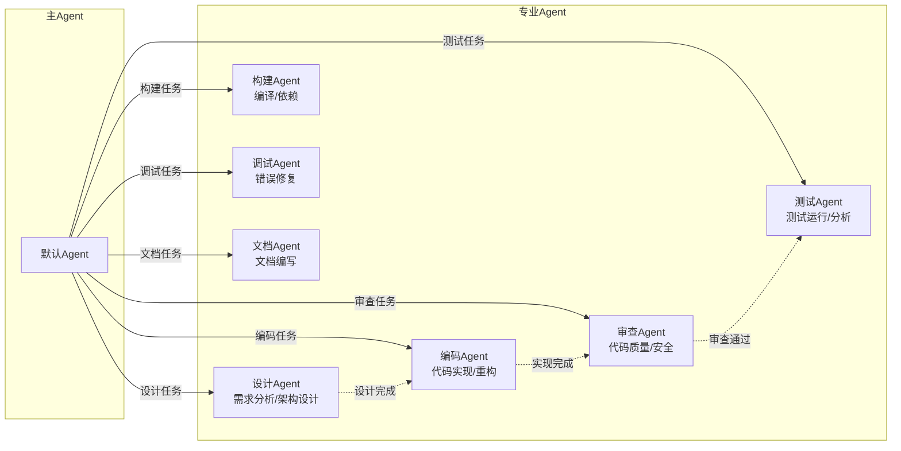
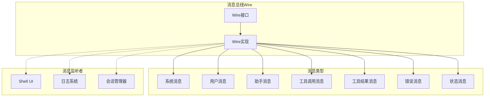

# Jimi：打造Java程序员专属的开源ClaudeCode

> 一个完全用Java实现的AI驱动CLI智能代理系统，为Java开发者带来可深度定制的类ClaudeCode开源。

[](https://www.oracle.com/java/)
[](https://spring.io/projects/spring-boot)
[](LICENSE)

---

## 📖 项目简介

Jimi 是一个功能强大的AI驱动的命令行智能代理系统，它将大语言模型（LLM）的智能能力与丰富的开发工具生态系统完美结合，为软件开发者提供智能化的开发助手体验。

### 核心价值

- **🚀 提升开发效率**：通过AI自动化完成重复性工作，让开发者专注于创造性任务
- **🧠 智能决策支持**：提供即时的技术咨询、代码建议和最佳实践指导
- **🔧 工具集成平台**：统一的工具调用接口，支持文件操作、Shell命令、网络访问等
- **🎯 专业化分工**：多Agent协作机制，不同Agent专注不同领域（设计、编码、审查等）
- **📚 知识注入系统**：Skills功能支持领域知识的模块化注入和自动激活

### 主要用途

- 代码生成与重构
- 技术问题诊断与解决
- 代码审查与质量分析
- 自动化任务执行
- 项目架构设计与咨询
- 文档生成与维护

---

## ✨ 核心特性

### 🤖 CLI智能代理
- 自然语言交互界面
- 交互式Shell环境（基于JLine）
- 丰富的元命令支持（`/help`、`/status`、`/tools`等）
- 彩色输出与中文友好的自动换行

### 🎭 多Agent支持
- **默认Agent**：通用开发助手
- **设计Agent**：需求分析、架构设计、技术选型
- **编码Agent**：代码实现、重构、优化
- **审查Agent**：代码质量审查、安全审计
- **构建Agent**：项目构建、依赖管理
- **自定义Agent**：支持YAML配置自定义Agent

### 🔄 异步子代理（Async Subagent）
- **后台独立运行**：子代理在后台执行，主代理可继续处理其他任务
- **生命周期管理**：支持启动、状态查询、取消、结果获取
- **多代理并行**：可同时运行多个后台子代理，互不干扰
- **事件通知机制**：实时接收子代理启动、进度、完成通知
- **超时控制**：可设置执行超时，防止资源占用
- **适用场景**：长时间构建、日志监控、并行任务处理

### 🧩 Skills系统
- 领域知识模块化管理
- 关键词自动匹配激活
- 团队知识共享与复用
- 高性能缓存机制（Caffeine）

### 🪝 Hooks系统
- 事件驱动的自动化机制
- 支持工具调用、Agent切换、错误处理等多种Hook类型
- YAML配置,支持热加载
- 条件执行与变量替换
- 优先级控制与异步执行

### 🔍 代码图(Code Graph)
- 基于LocAgent论文的代码理解能力
- AST图构建与持久化存储
- 混合检索(图检索 + 向量检索)
- 影响分析、调用图查询、可视化
- 智能代码定位与导航

### ⚡ 自定义命令系统
- YAML配置文件定义命令
- 支持Script/Agent/Composite类型
- 参数定义与前置条件检查
- 无需编写Java代码即可扩展
- 支持命令别名与优先级

### 🧠 ReCAP记忆优化
- 有界活动提示,保持提示大小O(1)
- 结构化上下文恢复机制
- 关键发现压缩与滑窗管理
- 支持递归Subagent协作
- Token消耗优化(节省30-50%)

### 🔌 LLM集成
- 支持多种LLM提供商（OpenAI、Moonshot等）
- 灵活的模型切换
- 流式响应处理
- 上下文智能压缩

### 🌐 MCP协议支持
- Model Context Protocol标准集成
- HTTP和StdIO两种通信方式
- 外部工具服务集成
- 示例配置（数据库、文件系统、Git、GitHub等）

### 🛠️ 丰富的工具系统
- **文件操作**：读取、写入、搜索、补丁应用
- **Shell执行**：命令执行与结果捕获
- **网络工具**：网页内容抓取、HTTP请求
- **待办事项**：任务管理与追踪
- **子Agent任务委托**：复杂任务分解与并行处理（支持同步/异步两种模式）
- **MCP工具**：动态加载外部工具
- **人工交互**：ask_human工具支持执行中暂停等待用户输入
- **代码图工具**：代码定位、影响分析、调用图查询
- **代码编排工具（MetaTool）**：支持通过Java代码编排多工具调用，减少30-40% context token消耗

### 🔐 高级功能
- **上下文压缩**：智能消息压缩，节省Token
- **审批机制**：敏感操作的人工审批控制
- **YOLO模式**：自动批准所有操作，提升效率
- **循环控制**：最大步数与运行时间限制
- **会话管理**：会话持久化与恢复

---

## 🏛️ 全局架构

### 系统整体架构

```mermaid
graph TB
    subgraph 用户交互层
        CLI[CLI命令行]
        Shell[JLine Shell]
    end
    
    subgraph 核心引擎层
        Engine[JimiEngine]
        Executor[AgentExecutor]
        Context[ExecutionContext]
        Approval[审批机制]
        Compaction[上下文压缩]
        Memory[ReCAP记忆优化]
        Interaction[人工交互]
    end
    
    subgraph Agent系统
        AgentRegistry[Agent注册表]
        DefaultAgent[默认Agent]
        DesignAgent[设计Agent]
        CodeAgent[编码Agent]
        ReviewAgent[审查Agent]
    end
    
    subgraph 工具系统
        ToolRegistry[工具注册表]
        FileTools[文件工具]
        BashTools[Shell工具]
        WebTools[网络工具]
        MCPTools[MCP工具]
        SubagentTools[子Agent工具]
        GraphTools[代码图工具]
        HumanTools[人工交互工具]
    end
    
    subgraph LLM集成层
        LLMFactory[LLM工厂]
        ChatProvider[聊天提供商]
        OpenAI[OpenAI]
        Moonshot[Moonshot]
    end
    
    subgraph Skills系统
        SkillRegistry[Skills注册表]
        SkillMatcher[Skills匹配器]
        SkillLoader[Skills加载器]
    end
    
    subgraph Hooks系统
        HookRegistry[Hooks注册表]
        HookExecutor[Hooks执行器]
        HookLoader[Hooks加载器]
    end
    
    subgraph 代码图系统
        GraphManager[Graph管理器]
        GraphBuilder[图构建器]
        GraphSearch[图检索引擎]
        ImpactAnalyzer[影响分析器]
    end
    
    subgraph 自定义命令
        CommandRegistry[命令注册表]
        CustomCommands[自定义命令]
    end
    
    subgraph 外部服务
        MCPServer[MCP服务]
        Database[数据库服务]
        GitService[Git服务]
    end
    
    CLI --> Shell
    Shell --> Engine
    Shell --> CommandRegistry
    Engine --> Executor
    Executor --> Context
    Executor --> AgentRegistry
    Executor --> ToolRegistry
    Executor --> LLMFactory
    Executor --> HookExecutor
    AgentRegistry --> DefaultAgent
    AgentRegistry --> DesignAgent
    AgentRegistry --> CodeAgent
    AgentRegistry --> ReviewAgent
    ToolRegistry --> FileTools
    ToolRegistry --> BashTools
    ToolRegistry --> WebTools
    ToolRegistry --> MCPTools
    ToolRegistry --> SubagentTools
    ToolRegistry --> GraphTools
    ToolRegistry --> HumanTools
    LLMFactory --> ChatProvider
    ChatProvider --> OpenAI
    ChatProvider --> Moonshot
    Engine --> Approval
    Engine --> Compaction
    Engine --> Memory
    Engine --> Interaction
    Engine --> SkillRegistry
    Engine --> GraphManager
    SkillRegistry --> SkillMatcher
    SkillRegistry --> SkillLoader
    HookRegistry --> HookExecutor
    HookRegistry --> HookLoader
    GraphManager --> GraphBuilder
    GraphManager --> GraphSearch
    GraphManager --> ImpactAnalyzer
    CommandRegistry --> CustomCommands
    MCPTools --> MCPServer
    MCPServer --> Database
    MCPServer --> GitService
```



### 核心执行流程



### Agent协作机制



### 工具系统架构

```mermaid
graph TD
    subgraph 工具注册机制
        ToolRegistry[工具注册表]
        ToolProvider[工具提供者接口]
        ToolRegistryFactory[工具注册表工厂]
    end
    
    subgraph 内置工具
        FileTools[文件操作工具]
        ReadFile[ReadFile]
        WriteFile[WriteFile]
        SearchFile[SearchFile]
        PatchFile[PatchFile]
        
        BashTools[Shell工具]
        RunCommand[RunCommand]
        
        WebTools[网络工具]
        FetchURL[FetchURL]
        SearchWeb[SearchWeb]
        
        ThinkTools[思考工具]
        Think[Think]
        
        TodoTools[待办工具]
        ManageTodo[ManageTodo]
        
        HumanTools[人工交互工具]
        AskHuman[AskHuman]
    end
    
    subgraph 代码图工具
        GraphTools[代码图工具]
        CodeLocate[CodeLocate]
        ImpactAnalysis[ImpactAnalysis]
        CallGraph[CallGraph]
    end
    
    subgraph 外部工具
        MCPTools[MCP工具]
        MCPClient[MCP客户端]
        HttpClient[HTTP客户端]
        StdioClient[StdIO客户端]
    end
    
    subgraph 子Agent工具
        SubagentTools[子Agent任务]
        DelegateTask[任务委托]
    end
    
    ToolRegistryFactory --> ToolRegistry
    ToolProvider --> ToolRegistry
    
    ToolRegistry --> FileTools
    ToolRegistry --> BashTools
    ToolRegistry --> WebTools
    ToolRegistry --> ThinkTools
    ToolRegistry --> TodoTools
    ToolRegistry --> HumanTools
    ToolRegistry --> GraphTools
    ToolRegistry --> MCPTools
    ToolRegistry --> SubagentTools
    
    FileTools --> ReadFile
    FileTools --> WriteFile
    FileTools --> SearchFile
    FileTools --> PatchFile
    
    BashTools --> RunCommand
    
    WebTools --> FetchURL
    WebTools --> SearchWeb
    
    ThinkTools --> Think
    
    TodoTools --> ManageTodo
    
    HumanTools --> AskHuman
    
    GraphTools --> CodeLocate
    GraphTools --> ImpactAnalysis
    GraphTools --> CallGraph
    
    MCPTools --> MCPClient
    MCPClient --> HttpClient
    MCPClient --> StdioClient
    
    SubagentTools --> DelegateTask
```



### 消息总线架构



---

## 🏗️ 技术栈

### 核心框架
- **Java 17**：现代Java特性支持
- **Spring Boot 3.2.5**：企业级应用框架
- **WebFlux**：响应式编程支持

### 命令行与交互
- **Picocli 4.7.6**：命令行参数解析
- **JLine 3.25.1**：终端交互与Shell实现

### 数据处理
- **Jackson 2.16.2**：JSON序列化/反序列化
- **SnakeYAML 2.2**：YAML配置解析

### 工具与库
- **Apache Commons Exec**：进程执行
- **Apache Commons Text**：文本处理
- **Jsoup 1.17.2**：HTML解析
- **Java Diff Utils 4.12**：补丁操作
- **Caffeine 3.1.8**：高性能缓存

### 开发工具
- **Lombok 1.18.32**：代码简化
- **SLF4J + Logback**：日志管理
- **JUnit 5 + Mockito**：测试框架

### 协议集成
- **MCP SDK 0.12.1**：Model Context Protocol支持

---

## 📂 目录结构概览

```
src/main/java/io/leavesfly/jimi/
├── agent/                  # Agent系统
│   ├── Agent.java          # Agent接口定义
│   ├── AgentRegistry.java  # Agent注册表
│   ├── AgentSpec.java      # Agent规范
│   └── AgentSpecLoader.java # Agent规范加载器
├── cli/                    # 命令行入口
│   └── CliApplication.java # CLI应用主类
├── command/                # 命令处理系统
│   ├── custom/             # 自定义命令
│   ├── handlers/           # 各种命令处理器
│   ├── CommandContext.java # 命令上下文
│   ├── CommandHandler.java # 命令处理器接口
│   └── CommandRegistry.java # 命令注册表
├── config/                 # 配置管理
│   ├── ConfigLoader.java   # 配置加载器
│   ├── JimiConfig.java     # 主配置类
│   ├── LLMModelConfig.java # LLM模型配置
│   ├── MemoryConfig.java   # 记忆配置(ReCAP)
│   └── LoopControlConfig.java # 循环控制配置
├── engine/                 # 核心引擎
│   ├── approval/           # 审批机制
│   ├── compaction/         # 上下文压缩
│   ├── context/            # 上下文管理
│   ├── interaction/        # 人工交互
│   ├── runtime/            # 运行时状态
│   ├── toolcall/           # 工具调用处理
│   ├── AgentExecutor.java  # Agent执行器
│   ├── Engine.java         # 引擎接口
│   └── JimiEngine.java     # Jimi引擎实现
├── graph/                  # 代码图系统
│   ├── builder/            # 图构建器
│   ├── model/              # 图数据模型
│   ├── navigator/          # 图导航
│   ├── parser/             # AST解析器
│   ├── search/             # 图检索引擎
│   ├── store/              # 图存储
│   ├── visualization/      # 可视化
│   └── GraphManager.java   # 图管理器
├── hook/                   # Hooks系统
│   ├── HookCondition.java  # Hook条件
│   ├── HookContext.java    # Hook上下文
│   ├── HookExecutor.java   # Hook执行器
│   ├── HookLoader.java     # Hook加载器
│   ├── HookRegistry.java   # Hook注册表
│   ├── HookSpec.java       # Hook规范
│   ├── HookTrigger.java    # Hook触发器
│   └── HookType.java       # Hook类型
├── llm/                    # LLM集成
│   ├── message/            # 消息模型
│   ├── provider/           # LLM提供商实现
│   ├── ChatProvider.java   # 聊天提供商接口
│   ├── LLM.java            # LLM包装类
│   └── LLMFactory.java     # LLM工厂
├── mcp/                    # MCP协议集成
│   ├── JsonRpcClient.java  # JSON-RPC客户端接口
│   ├── HttpJsonRpcClient.java # HTTP客户端实现
│   ├── StdIoJsonRpcClient.java # StdIO客户端实现
│   └── MCPConfig.java      # MCP配置
├── session/                # 会话管理
│   ├── Session.java        # 会话模型
│   ├── SessionManager.java # 会话管理器
│   └── WorkDirMetadata.java # 工作目录元数据
├── skill/                  # Skills系统
│   ├── SkillConfig.java    # Skills配置
│   ├── SkillLoader.java    # Skills加载器
│   ├── SkillMatcher.java   # Skills匹配器
│   ├── SkillProvider.java  # Skills提供者
│   ├── SkillRegistry.java  # Skills注册表
│   └── SkillSpec.java      # Skills规范
├── tool/                   # 工具系统
│   ├── bash/               # Shell工具
│   ├── file/               # 文件操作工具
│   ├── graph/              # 代码图工具
│   ├── human/              # 人工交互工具
│   ├── mcp/                # MCP工具
│   ├── task/               # 子Agent任务工具
│   ├── think/              # 思考工具
│   ├── todo/               # 待办事项工具
│   ├── web/                # 网络工具
│   ├── Tool.java           # 工具接口
│   ├── ToolProvider.java   # 工具提供者接口
│   ├── ToolRegistry.java   # 工具注册表
│   └── ToolRegistryFactory.java # 工具注册表工厂
├── ui/                     # 用户界面
│   └── shell/              # Shell交互界面
│       ├── ShellUI.java    # Shell UI主类
│       └── OutputFormatter.java # 输出格式化
├── wire/                   # 消息总线
│   ├── message/            # 各类消息定义
│   ├── Wire.java           # 消息总线接口
│   └── WireImpl.java       # 消息总线实现
├── JimiApplication.java    # Spring Boot启动类
└── JimiFactory.java        # Jimi工厂类

src/main/resources/
├── agents/                 # Agent配置目录
│   ├── default/            # 默认Agent
│   ├── design/             # 设计Agent
│   ├── code/               # 编码Agent
│   ├── review/             # 审查Agent
│   └── build/              # 构建Agent
├── commands/               # 自定义命令配置
├── hooks/                  # Hooks配置目录
├── skills/                 # Skills配置目录
│   ├── code-review/        # 代码审查Skill
│   └── unit-testing/       # 单元测试Skill
├── mcp/                    # MCP配置示例
├── application.yml         # Spring Boot配置
└── logback-spring.xml      # 日志配置
```

---

## 🚀 安装与配置

### 环境要求

- **Java**: 17 或更高版本
- **Maven**: 3.6 或更高版本
- **操作系统**: macOS、Linux 或 Windows

### 快速安装（推荐）

使用一键安装脚本：

```bash
# 克隆或下载项目
cd /path/to/Jimi

# 运行一键安装脚本
./scripts/quick-install.sh
```

脚本会自动完成：
1. ✅ 环境检查
2. ✅ 依赖安装（如需要）
3. ✅ 项目构建
4. ✅ 配置初始化
5. ✅ 启动服务

### 分步安装

#### 1. 检查环境

```bash
./scripts/check-env.sh
```

#### 2. 安装依赖（如需要）

```bash
./scripts/install-deps.sh
```

#### 3. 构建项目

```bash
# 跳过测试快速构建
./scripts/build.sh --skip-tests

# 完整构建
./scripts/build.sh
```

#### 4. 初始化配置

```bash
./scripts/init-config.sh
```

配置向导会引导您完成：
- LLM服务提供商选择（OpenAI、Moonshot等）
- API Key配置
- 模型选择
- 高级参数设置

#### 5. 启动Jimi

```bash
./scripts/start.sh
```

### 配置文件说明

#### application.yml
位置：`src/main/resources/application.yml`

Spring Boot应用配置，包括：
- 日志级别配置
- Jackson序列化配置
- Skills功能开关与参数

#### config.json
位置：`~/.jimi/config.json`

用户配置文件，包括：
- LLM提供商配置（API Key、Base URL）
- 默认模型选择
- 循环控制参数
- 功能开关（Skills、审批、YOLO模式）

示例配置：
```json
{
  "llm": {
    "providers": {
      "moonshot": {
        "apiKey": "your-api-key-here",
        "baseUrl": "https://api.moonshot.cn/v1"
      }
    },
    "defaultProvider": "moonshot",
    "defaultModel": "moonshot-v1-8k"
  },
  "loopControl": {
    "maxSteps": 50,
    "maxRuntime": 3600
  },
  "features": {
    "enableSkills": false,
    "enableApproval": false,
    "enableYoloMode": false
  }
}
```

---

## 🎯 快速开始

### 基本使用

1. **启动Jimi**
```bash
./scripts/start.sh
```

2. **查看帮助**
```
/help
```

3. **开始对话**
```
你好，请帮我分析一下这个Java项目的结构
```

### 常用命令

#### 元命令
- `/help, /h, /?` - 显示帮助信息
- `/quit, /exit` - 退出程序
- `/version, /v` - 显示版本信息
- `/status` - 显示当前状态
- `/config` - 显示配置信息
- `/tools` - 显示可用工具列表
- `/clear, /cls` - 清屏
- `/history` - 显示命令历史
- `/reset` - 清除上下文历史
- `/compact` - 压缩上下文
- `/init` - 分析代码库并生成文档
- `/graph` - 代码图管理命令
  - `/graph build` - 构建代码图
  - `/graph stats` - 查看图统计信息
  - `/graph rebuild` - 重新构建代码图
- `/hooks` - Hooks管理命令
  - `/hooks list` - 列出所有Hooks
  - `/hooks reload` - 重新加载Hooks
  - `/hooks enable <name>` - 启用Hook
  - `/hooks disable <name>` - 禁用Hook
- `/commands` - 自定义命令管理
  - `/commands list` - 列出所有自定义命令
  - `/commands reload` - 重新加载命令
  - `/commands enable <name>` - 启用命令
  - `/commands disable <name>` - 禁用命令

#### Shell快捷方式
```
! ls -la        # 执行Shell命令
! pwd           # 显示当前目录
! mvn test      # 运行Maven测试
```

### 使用示例

#### 示例1：代码分析
```
请分析src/main/java/io/leavesfly/jimi/JimiEngine.java的设计模式
```

#### 示例2：代码生成
```
请帮我实现一个用户注册功能，包括参数验证和异常处理
```

#### 示例3：任务委托
```
请使用设计Agent帮我设计一个电商系统的订单模块架构
```

#### 示例4：代码审查
```
请审查UserService.java的代码质量和潜在问题
```

---

## 🔧 使用指南

### 工作模式

#### 1. 交互式模式（默认）
直接与Jimi对话，逐步解决问题：
```bash
./scripts/start.sh
```

#### 2. 命令模式
通过命令行参数直接执行任务：
```bash
./scripts/start.sh -c "请帮我分析这个项目"
```

#### 3. YOLO模式
自动批准所有操作，无需人工确认：
```bash
./scripts/start.sh --yolo
```

### 指定Agent

使用特定Agent处理任务：
```bash
# 使用设计Agent
./scripts/start.sh --agent design

# 使用编码Agent
./scripts/start.sh --agent code

# 使用自定义Agent配置
./scripts/start.sh --agent-file /path/to/custom-agent.yaml
```

### 指定工作目录

```bash
./scripts/start.sh --work-dir /path/to/project
```

### 会话管理

```bash
# 使用指定会话
./scripts/start.sh --session my-project

# 恢复上次会话
./scripts/start.sh --resume
```

---

## 🛠️ 扩展性说明

### 自定义Agent

1. **创建Agent配置文件**

在`src/main/resources/agents/`目录下创建新的Agent目录：

```
agents/
└── my-custom-agent/
    ├── agent.yaml          # Agent配置
    └── system_prompt.md    # 系统提示词
```

2. **agent.yaml示例**
```yaml
name: My Custom Agent
description: 我的自定义Agent
subagents:
  - code
  - review
tools:
  - read_file
  - write_to_file
  - bash
skills: []
```

3. **使用自定义Agent**
```bash
./scripts/start.sh --agent my-custom-agent
```

### 自定义工具

1. **实现ToolProvider接口**

```java
@Component
public class MyToolProvider implements ToolProvider {
    
    @Override
    public List<Tool> getTools(ToolRegistry registry) {
        return List.of(new MyCustomTool());
    }
}
```

2. **实现Tool接口**

```java
public class MyCustomTool extends AbstractTool<MyParams> {
    
    @Override
    public String getName() {
        return "my_custom_tool";
    }
    
    @Override
    public String getDescription() {
        return "我的自定义工具";
    }
    
    @Override
    protected Mono<ToolResult> executeInternal(MyParams params) {
        // 工具逻辑实现
        return Mono.just(ToolResult.success("执行成功"));
    }
}
```

### 自定义命令

1. **创建命令配置文件**

在`~/.jimi/commands/`或项目的`.jimi/commands/`目录下创建命令配置：

```yaml
name: "quick-build"
description: "快速构建并运行测试"
category: "build"

aliases:
  - "qb"

usage: "/quick-build [--skip-tests]"

parameters:
  - name: "skip-tests"
    type: "boolean"
    defaultValue: "false"

execution:
  type: "script"
  script: |
    #!/bin/bash
    if [ "$SKIP_TESTS" = "true" ]; then
      mvn clean install -DskipTests
    else
      mvn clean install
    fi
  timeout: 300

preconditions:
  - type: "file_exists"
    path: "pom.xml"
```

2. **使用自定义命令**
```bash
/quick-build
/qb --skip-tests
```

详细使用请参考：[docs/CUSTOM_COMMANDS.md](docs/CUSTOM_COMMANDS.md)

### 自定义Hooks

1. **创建Hook配置文件**

在`~/.jimi/hooks/`或项目的`.jimi/hooks/`目录下创建Hook配置：

```yaml
name: "auto-format-java"
description: "保存Java文件后自动格式化"
enabled: true
priority: 10

trigger:
  type: "POST_TOOL_CALL"
  tools:
    - "WriteFile"
    - "StrReplaceFile"
  file_patterns:
    - "*.java"

execution:
  type: "script"
  script: |
    #!/bin/bash
    for file in ${MODIFIED_FILES}; do
      google-java-format -i "$file"
      echo "✅ 已格式化: $file"
    done
  workingDir: "${JIMI_WORK_DIR}"
  timeout: 30
```

2. **Hook类型**
- `PRE_TOOL_CALL` - 工具执行前
- `POST_TOOL_CALL` - 工具执行后
- `PRE_AGENT_SWITCH` - Agent切换前
- `POST_AGENT_SWITCH` - Agent切换后
- `ON_ERROR` - 错误发生时
- `ON_SESSION_START` - 会话启动时
- `ON_SESSION_END` - 会话结束时

详细使用请参考：[docs/HOOKS.md](docs/HOOKS.md)

1. **实现CommandHandler接口**

```java
@Component
public class MyCommandHandler implements CommandHandler {
    
    @Override
    public String getCommand() {
        return "mycommand";
    }
    
    @Override
    public String getDescription() {
        return "我的自定义命令";
    }
    
    @Override
    public void handle(CommandContext context) {
        // 命令处理逻辑
    }
}
```

2. **Spring自动注册**

Spring会自动扫描并注册所有`CommandHandler`实现。

### 集成MCP工具

1. **创建MCP配置文件**

在`src/main/resources/mcp/`目录下创建配置：

```json
{
  "name": "my-service",
  "description": "我的MCP服务",
  "type": "http",
  "config": {
    "url": "http://localhost:8080"
  }
}
```

2. **启动时加载**
```bash
./scripts/start.sh --mcp-config-file src/main/resources/mcp/my-service.json
```

---

## 📚 进阶功能

### 代码图(Code Graph)

代码图功能基于LocAgent论文实现,提供强大的代码理解和导航能力。

#### 启用代码图

1. **配置`application.yml`**
```yaml
jimi:
  graph:
    enabled: true
    auto-build: false
    build-on-startup: false
    include-patterns:
      - "**/*.java"
    exclude-patterns:
      - "**/test/**"
      - "**/target/**"
```

2. **构建代码图**
```bash
jimi> /graph build
开始构建代码图...
项目路径: /path/to/project

✅ 代码图构建完成

统计信息:
  实体数: 1523
  关系数: 3847
  耗时: 2345ms
```

3. **使用代码图工具**

Agent会自动获得以下工具：
- **CodeLocateTool**: 智能代码定位
- **ImpactAnalysisTool**: 影响分析
- **CallGraphTool**: 调用图查询

```bash
jimi> 查找GraphManager类的调用关系
jimi> 分析修改GraphBuilder的影响
```

详细使用请参考：[docs/GRAPH_GUIDE.md](docs/GRAPH_GUIDE.md)

### Hooks系统

Hooks系统是Jimi的事件驱动自动化机制,允许在关键节点自动执行自定义操作。

#### 常见场景

1. **自动代码格式化**
```yaml
trigger:
  type: "POST_TOOL_CALL"
  tools:
    - "WriteFile"
  file_patterns:
    - "*.java"

execution:
  type: "script"
  script: "google-java-format -i ${MODIFIED_FILE}"
```

2. **Git提交前测试**
```yaml
trigger:
  type: "PRE_TOOL_CALL"
  tools:
    - "Bash"

execution:
  type: "script"
  script: |
    if [[ "${TOOL_RESULT}" == *"git commit"* ]]; then
      mvn test || exit 1
    fi
```

3. **错误自动修复**
```yaml
trigger:
  type: "ON_ERROR"
  errorPattern: ".*compilation error.*"

execution:
  type: "agent"
  agent: "Code-Agent"
  task: "分析编译错误并自动修复"
```

详细使用请参考：[docs/HOOKS.md](docs/HOOKS.md)

### 自定义命令

通过YAML配置文件创建自定义命令,无需编写Java代码。

#### 支持的执行类型

1. **Script类型**: 执行Shell脚本
2. **Agent类型**: 委托给Agent执行
3. **Composite类型**: 组合多个步骤

#### 示例：快速构建命令

```yaml
name: "quick-build"
description: "快速构建并运行测试"

aliases:
  - "qb"

parameters:
  - name: "skip-tests"
    type: "boolean"
    defaultValue: "false"

execution:
  type: "script"
  script: |
    if [ "$SKIP_TESTS" = "true" ]; then
      mvn clean install -DskipTests
    else
      mvn clean install
    fi
```

使用：
```bash
/quick-build
/qb --skip-tests
```

详细使用请参考：[docs/CUSTOM_COMMANDS.md](docs/CUSTOM_COMMANDS.md)

### ReCAP记忆优化

ReCAP(递归上下文感知推理与规划)是Jimi的记忆优化机制,解决长任务链和多 Subagent 协作场景下的记忆管理挑战。

#### 核心机制

1. **有界活动提示**：保持提示大小O(1),避免无限增长
2. **结构化上下文恢复**：父子Agent间语义连续性
3. **关键发现压缩**：高层意图+摘要式关键发现始终保持

#### 配置启用

在`application.yml`中配置：

```yaml
jimi:
  memory:
    # 有界提示最大Token数
    activePromptMaxTokens: 4000
    
    # 关键发现窗口大小
    insightsWindowSize: 5
    
    # 启用ReCAP优化
    enableRecap: true
    
    # 最大递归深度
    maxRecursionDepth: 5
```

#### 优化效果

- 提示大小从O(n)变为O(1)
- Token消耗节省30-50%
- 支持深度递归Subagent协作(最多5层)
- 高层意图和关键信息不丢失

详细使用请参考：[docs/ReCAP记忆优化技术方案.md](docs/ReCAP记忆优化技术方案.md)

### Skills系统

Skills是Jimi的知识注入机制，允许将领域专业知识模块化并自动激活。

#### 创建Skill

1. **创建Skill目录**
```
skills/
└── my-skill/
    └── skill.yaml
```

2. **skill.yaml示例**
```yaml
name: My Skill
description: 我的专业技能
keywords:
  - 关键词1
  - 关键词2
content: |
  这里是Skill的详细内容，包括：
  - 专业知识
  - 最佳实践
  - 代码示例
  - 注意事项
```

#### 启用Skills功能

在`application.yml`中：
```yaml
jimi:
  skill:
    enabled: true
    auto-match: true
```

### 上下文压缩

当对话历史过长时，自动压缩上下文以节省Token：

```
/compact
```

手动触发压缩，或等待自动触发（基于Token阈值）。

### 审批机制

对于敏感操作（如文件写入、命令执行），需要人工审批：

```
# 在配置中启用
"features": {
  "enableApproval": true
}
```

---

## 🤝 贡献指南

我们欢迎社区贡献！以下是参与贡献的方式：

### 如何贡献

1. **Fork本仓库**
2. **创建特性分支** (`git checkout -b feature/AmazingFeature`)
3. **提交更改** (`git commit -m 'Add some AmazingFeature'`)
4. **推送到分支** (`git push origin feature/AmazingFeature`)
5. **开启Pull Request**

### 贡献类型

- 🐛 Bug修复
- ✨ 新功能开发
- 📝 文档改进
- 🎨 代码重构
- ⚡ 性能优化
- ✅ 测试用例补充
- 🌐 国际化支持

### 代码规范

- 遵循Java编码规范
- 使用Lombok简化代码
- 编写单元测试
- 添加必要的注释
- 保持代码简洁清晰

### 提交规范

使用语义化的提交信息：
```
feat: 添加新功能
fix: 修复Bug
docs: 更新文档
style: 代码格式调整
refactor: 代码重构
test: 测试相关
chore: 构建/工具链相关
```

---

## 📄 许可证

本项目采用 Apache License 2.0 许可证。详见 [LICENSE](LICENSE) 文件。

---

## 🙏 致谢

感谢以下开源项目和社区：

- [Spring Boot](https://spring.io/projects/spring-boot) - 企业级应用框架
- [Project Reactor](https://projectreactor.io/) - 响应式编程库
- [Picocli](https://picocli.info/) - 命令行解析框架
- [JLine](https://github.com/jline/jline3) - 终端交互库
- [Caffeine](https://github.com/ben-manes/caffeine) - 高性能缓存
- [Model Context Protocol](https://modelcontextprotocol.io/) - AI工具标准协议

---

## 📞 联系我们

- **Issues**: [GitHub Issues](https://github.com/your-repo/jimi/issues)
- **Discussions**: [GitHub Discussions](https://github.com/your-repo/jimi/discussions)
- **文档**: [项目文档](.qoder/repowiki/)

---

## 🌟 Star History

如果这个项目对你有帮助，请给我们一个 ⭐️ Star！

---

**Happy Coding with Jimi! 🎉**
